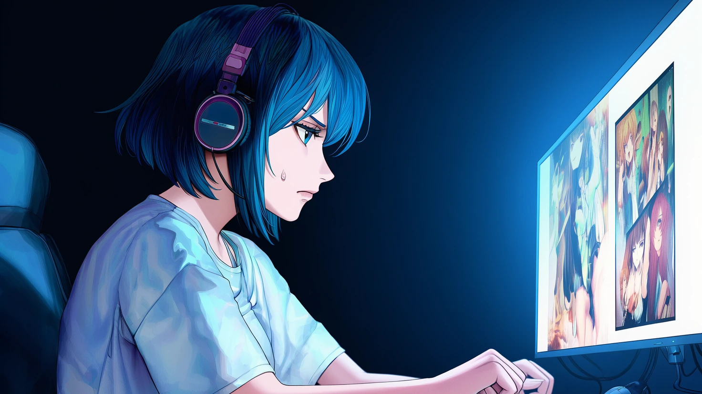
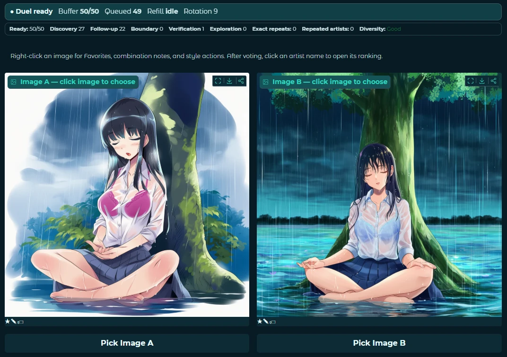
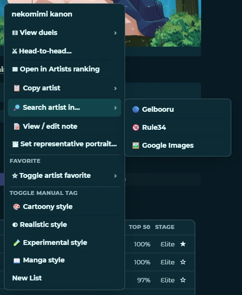
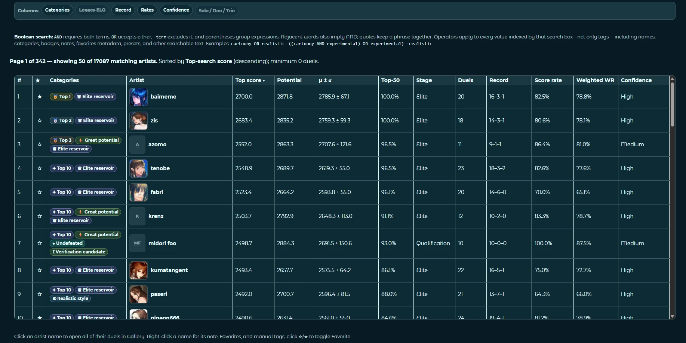
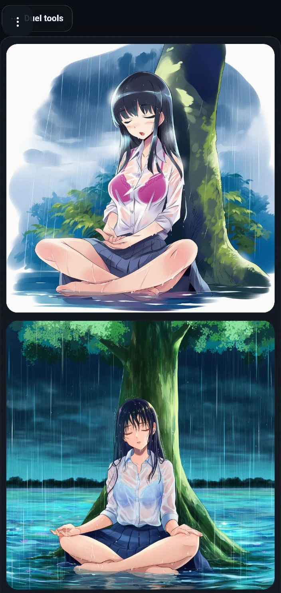
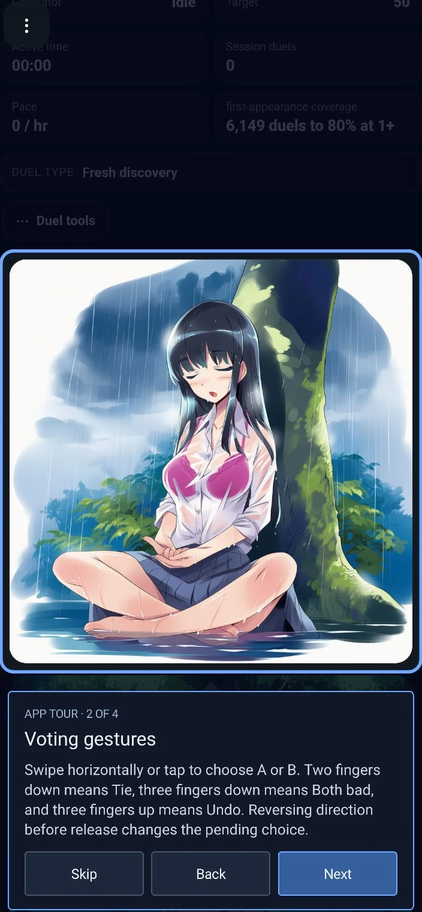
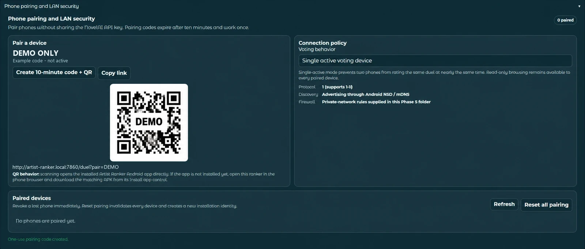

# NovelAI Artist Ranker

> **Creator's preface**
>
> _Hey, im SeaBass i created this thing mostly for myself but as i added more and more stuff i decided that some people might benefit from me sharing it.
In case you couldn't tell already this entire project was 1000% vibecoded, specifically using chatgpt, even the documentation is done by it, just to let you know, enjoy!
Also this project should with very little tweaking work with Anima local generation instead of NAI, since they too have a lot of artists tags, let me know if thats something you would want._

NovelAI Artist Ranker aims to help you discover strong and appealing artists tag tailored to you, by turning the task into a repeatable simple blind-comparison workflow. It generates controlled A/B image duels, records your choices, and gradually builds personal rankings for individual artist tags and artist combinations. The statistics do the remembering; your only job is to judge two pictures with unreasonable seriousness.

Now supporting both NovelAI and local Anima!

Votes feed a Bayesian pairwise-ranking model, so upsets matter more and uncertainty falls as evidence accumulates. Matchmaking favors comparisons likely to teach the system something while mixing in discovery, follow-ups, and verification and avoiding recent repeats. [See the short technical explanation](#how-scoring-and-matchmaking-work).

<p align="center">
  
</p>

Everything runs on your own Windows computer. Your API key, prompts, images, rankings, favorites, history, and backups remain under your control. A phone can join over your local network, but the Android app is entirely optional—the desktop interface and a normal phone browser work without it.

**Quick links:** [Latest release](https://github.com/SeaBassBand/NovelAI-Artist-Ranker/releases/latest) · [Installation](#installation-options) · [Features](#what-it-does) · [Data control](#your-data-your-rules) · [Privacy and network behavior](#privacy-security-and-network-behavior) · [Source installation](SOURCE_INSTALL.md)

> [!IMPORTANT]
> This is an independent community project and is not affiliated with or endorsed by NovelAI. Image generation requires your own NovelAI account and API access.

## What it does

At its core, the Ranker presents two images generated under controlled conditions and asks you to choose Image A, Image B, Tie / Too close, Both bad, or Invalid duel. Both sides use the same seed so the artist tags—not a lucky composition—have a fairer chance to explain your preference.

<p align="center">
  
</p>

The system does considerably more than keep a single score:

- **Blind solo, duo, and trio comparisons.** Rank individual artist tags as well as complete artist combinations without revealing the answer before you vote.
- **Bayesian rankings with useful context.** Track skill estimates, uncertainty, duel counts, win rates, confidence-aware statistics, opponent strength, and separate solo/duo/trio performance.
- **Purposeful matchmaking.** Balance fresh discovery, close-rating comparisons, newcomer challenges, follow-ups, boundary checks, verification, and exploration while penalizing recent repeats.
- **Buffered generation.** Keep a configurable queue of ready duels so voting can continue while replacement images generate in the background.
- **Controlled image generation.** Manage positive and negative prompts, saved prompt presets, generation profiles, per-duel prompt rotation, model settings, samplers, steps, dimensions, and related NovelAI options.
- **Optional local Anima generation.** Use a separate Local/Anima archive with an existing ComfyUI or Forge/Neo Forge endpoint. The Ranker can scan common local endpoints, lets you connect manually, and can show native generation previews in the normal duel cards for the first 0-10 buffered duels. Local and NovelAI ladders, prompts, tags, buffers, and history stay separate when you switch modes.
- **Inspectable results.** Browse artist and combination ladders, reveal tags after voting, open artist details, review rating changes, and undo or redo recent decisions.
- **A real history Gallery.** Search and filter previous duels, inspect full generation snapshots, switch between thumbnails and original images, and continue resolving historical images after moving the application or Data folder.
- **Favorites and notes.** Save artists, combinations, individual images, or complete duels; attach notes and organize material you want to revisit.
- **Local session statistics.** Monitor buffer state, pace, coverage, generation reliability, and timing without sending those analytics to the project maintainer.

### Convenience features

Right-click an artist name for notes, favorites, portraits, external searches, and copy formats. The copy submenu keeps the formats in a predictable order: NovelAI syntax, Anima syntax, raw name, then booru tag. This makes it quick to move a winning artist into the prompt editor or a local-generation workflow.

<p align="center">
  
</p>

### Artist ladder

The ladder is more than a sorted name list. It combines portraits, categories and manual tags with conservative Top-search score, potential, uncertainty, Top-50 probability, stage, duel count, record, score rate, weighted win rate, and confidence. It is paged and searchable, and opening an artist takes you to the related Gallery history and actions.

<p align="center">
  
</p>

## Installation options

Download official packages from the [latest GitHub Release](https://github.com/SeaBassBand/NovelAI-Artist-Ranker/releases/latest). The release also includes `SHA256SUMS.txt` so every downloaded artifact can be checked before use.

| Method | Best for | Requirements | What it entails | Updates |
|---|---|---|---|---|
| **Windows Setup** (`NovelAI-Artist-Ranker-Setup.exe`) | Most users | Windows and NovelAI API access | Installs the self-contained app, lets you choose the program drive, and creates normal launch/uninstall entries. Python and runtime dependencies are included. | Use the Ranker's verified update workflow or install a newer Setup release. |
| **Portable ZIP** (`NovelAI-Artist-Ranker-Portable-vX.Y.Z.zip`) | Removable drives, isolated folders, or no formal installation | Windows and NovelAI API access | Extract anywhere writable and launch from that folder. It includes the same private Python runtime and does not require system Python, Git, Java, Gradle, or an Android SDK. | Replace it with a newer Portable ZIP or use the verified Update ZIP workflow. Keep Data outside the replaceable program folder when practical. |
| **GitHub source installation** | Contributors and users who prefer Git-based updates | Windows, **Python 3.11**, and Git for Windows | Clones the stable `release` branch, creates a repository-local `.venv`, installs the locked dependencies, creates local configuration, and places user data outside Git. | Close the Ranker and run `Update and Start.bat`. It refuses dirty working trees and performs only `git pull --ff-only`. |
| **Local Anima mode** | Users with a local ComfyUI or Forge/Neo Forge setup | A running local diffuser endpoint and an Anima-compatible workflow/model | Enable Local/Anima in Maintenance, choose a detected endpoint or enter its URL, then configure the workflow/API bindings and generation profile. This is optional; NovelAI mode remains unchanged and uses its own archive. | Keep the diffuser endpoint updated separately. The Ranker stores local-generation settings and results in the Local/Anima archive. |
| **Update ZIP** (`NovelAI-Artist-Ranker-Update-vX.Y.Z.zip`) | An existing Setup or Portable installation | A compatible installed release | This is **not a first-time installer**. The Ranker inspects its manifest and checksums, creates a restore point, and schedules the update for the next startup. | Built specifically for the safe in-app packaged-update workflow. Source clones never apply it over tracked files. |

### Recommended: Windows Setup

1. Download `NovelAI-Artist-Ranker-Setup.exe` and `SHA256SUMS.txt` from the latest release.
2. Optionally verify the file with `Get-FileHash -Algorithm SHA256` in PowerShell and compare it with `SHA256SUMS.txt`.
3. Run Setup and select the program location.
4. Launch NovelAI Artist Ranker. The normal launcher keeps a visible log window open; closing that window stops the local server. A background/tray launcher is also available.

The packaged app carries its own Python runtime. Installing Python separately will not make Setup or Portable work better.

### Portable installation

Extract the Portable ZIP to a normal writable folder, then run `Launch Artist Ranker.cmd`. The program files are replaceable; your rankings and generated images should live in the Data location selected during first-run setup.

Portable refers to the program package. A complete profile export is the appropriate way to move rankings, settings, portraits, history, and optionally images between computers.

### Install from GitHub source

```bat
git clone --branch release --single-branch https://github.com/SeaBassBand/NovelAI-Artist-Ranker.git
cd NovelAI-Artist-Ranker
Install.bat
```

`Install.bat` validates Python 3.11, creates `.venv`, installs `requirements.lock.txt`, chooses an external Data folder, and starts the Ranker. Later launches reuse the same environment through `Start.bat`. For updates, close the running server and use `Update and Start.bat`.

The updater never resets, overwrites, or discards local edits. If the branch is not `release`, the repository is dirty, or the update cannot fast-forward, it stops and explains why. See [SOURCE_INSTALL.md](SOURCE_INSTALL.md) for the focused source-install guide.

## First run

1. Open the local Ranker page launched on your computer.
2. Save your NovelAI API key from Settings. On Windows it is stored in **Windows Credential Manager**, not in the Git repository or a plain-text config file.
3. Choose an Installed, Portable, or Custom Data location.
4. Review image-retention limits and create an initial backup outside the active Data folder.
5. Configure a generation profile or start with the public defaults.
6. Begin voting. Phone pairing can be added later and is never required.

## Your data, your rules

The program is designed around a replaceable application folder and a separately managed Data folder. You decide where the important material lives and how aggressively it is retained.

| Area | Controls available |
|---|---|
| **Data location** | Choose installed, portable, or custom storage; preview migrations; keep program files, user data, Git source, and backups in separate locations. |
| **Generated images** | Set count- and space-based retention, preview storage impact and free space, preserve favorited material, clean temporary thumbnails, and inspect orphan candidates before deletion. |
| **Backups** | Create metadata-only or complete exports, choose an external backup folder, schedule backups, enforce count/space retention, verify archives, and restore deliberately. |
| **Transfers** | Export portable profiles and import them on another drive or computer. Portrait and historical-media references are relocated automatically when possible. |
| **History and favorites** | Search, filter, thumbnail, inspect, favorite, annotate, archive, or remove material through dedicated views. |
| **Matchmaking** | Adjust selection behavior, active-pool size, newcomer pressure, repeat avoidance, discovery balance, and related ranking controls. |
| **Generation** | Control prompts, profiles, rotation, dimensions, steps, sampler/model choices, and the size of the ready-duel buffer. |
| **Updates** | Select stable or beta channels, run checks manually, optionally enable periodic GitHub checks, preview packages, and require confirmation before scheduling. Automatic checking is off by default. |
| **Maintenance** | Run deep integrity audits, inspect missing/ambiguous media, review storage health, create sanitized diagnostics, and copy recent redacted logs. |

No automatic cloud backup exists. If you lose your Data folder and external backups, the project maintainer cannot recover them for you.

## Phone voting and the optional Android app

You can vote from the Windows interface, from a phone browser on the same LAN, or from the signed Android companion. The APK is a **local companion**, not a separate hosted service and not a requirement for using the Ranker.

<p align="center">
  
  &nbsp;&nbsp;
  
</p>

The mobile interface supports taps and compact gestures: swipe horizontally or tap to choose A or B, two fingers down for Tie, three fingers down for Both bad, and three fingers up for Undo. Reversing direction before release changes the pending choice.

### APK behavior

- The Windows Ranker remains the server and the source of truth.
- The phone does **not** receive or store your NovelAI API key.
- Pairing uses a six-character, one-use code or QR link that expires after ten minutes.
- Each paired device receives its own local credential and can be revoked.
- Connection policy can limit voting to one active phone while allowing paired devices to browse read-only information.
- Resetting pairing invalidates all device credentials and creates a new installation identity.
- The APK is signed and published with each matching GitHub Release. It can be downloaded from the Release page or from the running Ranker's Install app control.

<p align="center">
  
</p>

The screenshot above is deliberately anonymized: the hostname, pairing code, link, and original QR were replaced with nonfunctional demo values.

## Privacy, security, and network behavior

There is no NovelAI Artist Ranker account, project-operated cloud backend, relay, tunnel, advertising system, or remote-administration service. The maintainer has no route to view your API key, prompts, generated images, votes, rankings, favorites, history, or backups.

Normal operation is intentionally local:

```text
Phone or browser  <── your local network ──>  Ranker on your Windows PC
                                               │
                                               └── image generation / account test ──> NovelAI
```

The application explicitly disables Gradio framework analytics. Its own generation timing and reliability statistics are local data, not project telemetry.

There are a few transparent, user-controlled exceptions:

- **GitHub:** manual release checks, enabled periodic update checks, and requested Setup/ZIP/APK downloads contact GitHub. Automatic update checking is off by default.
- **Source installation:** the initial `Install.bat` run obtains locked Python packages from the configured Python package index; Git updates contact GitHub.
- **External artist searches:** choosing an external search action can open Gelbooru, Rule34, or Google in your normal browser. These sites are not contacted merely by ranking images.

Your NovelAI credential is stored through Windows Credential Manager and is retrieved only when a NovelAI session is needed. Secret-management and launcher-control endpoints accept only requests from the same PC. Pairing credentials are scoped to the local Ranker and can be revoked without changing the NovelAI key.

When Local/Anima mode is enabled, the Ranker contacts only the local ComfyUI or Forge/Neo Forge endpoint you select (normally on `127.0.0.1` or your LAN). It does not upload local prompts, images, or rankings to the project maintainer. The local diffuser is your software and remains under your control.

Because the interface is intentionally available to devices on your LAN, run it only on a network you trust and keep Windows Firewall set to private-network access. The dedicated phone workflow requires pairing, but local-network exposure is still a security boundary you control.

Release packages are scanned to exclude credentials, pairing state, user data, private images, diagnostics, Android signing material, caches, and maintainer-only paths. Update/import archives are path-validated and SHA-256 checked before use. Diagnostic bundles are sanitized, but you should still review anything before sharing it publicly.

See [SECURITY.md](SECURITY.md) for the concise security policy.

## How scoring and matchmaking work

The main ranker is a **Bayesian Bradley–Terry pairwise-preference model**. Each artist starts with a mean skill estimate (`mu`) of 1500 and high uncertainty (`sigma`) of 350. A logistic curve predicts the result of each duel; the observed A, B, or Tie result immediately updates both the estimated skill and its uncertainty. Unexpected results move the estimate more, while repeated evidence narrows uncertainty. Periodic deterministic global MAP refits replay all relative evidence to reduce vote-order effects and recalibrate the model.

For duos and trios, team strength is the average of the members' skill estimates plus a separate Bayesian synergy estimate for that exact combination. Multi-artist results contribute less individual evidence than solo results. Both bad updates a separate reliability probability without pretending either side won; Invalid duel adds no ranking evidence. If an artist appears on both sides, that shared artist is neutral.

The **Top-K search** uses the full posterior—not only the mean score. The displayed conservative ranking uses an 80% one-sided lower credible bound (`mu - 1.28 × sigma`), and posterior sampling estimates each artist's probability of belonging in the Top 50. Matchmaking prioritizes uncertain comparisons, artists near the Top-50/Top-100 boundaries, high-potential candidates, discovery and follow-up stages, stale recalls, bridge comparisons, and elite verification. Expected information is greatest near a predicted 50/50 result; recent artists, exact matchups, repeated combinations, and anything already buffered are penalized or excluded. Both images use the same seed and controlled settings so the evidence is more about artist tags than random composition differences.

## Updating safely

Packaged installations can check GitHub from Maintenance, download the matching Update ZIP, preview its contents, and schedule it. The next startup applies only checksum-listed files after creating a restore point; a failed application attempts to roll back changed files.

Source installations follow a different rule: close the Ranker and run `Update and Start.bat`. Binary Update ZIP controls are disabled in source mode so Git-managed files are never mixed with the packaged updater.

## Repository and release documents

- [SOURCE_INSTALL.md](SOURCE_INSTALL.md) — focused Git/Python installation instructions
- [FOLDER_LAYOUT.md](FOLDER_LAYOUT.md) — recommended separation of program, Data, source, backups, and private development files
- [BUILDING.md](BUILDING.md) — public release-build overview
- [SECURITY.md](SECURITY.md) — supported-version and local-security policy
- [SECURITY_DEPENDENCIES.md](SECURITY_DEPENDENCIES.md) — dependency-security information
- [THIRD_PARTY_NOTICES.md](THIRD_PARTY_NOTICES.md) — third-party acknowledgements
- [RELEASE_NOTES.md](RELEASE_NOTES.md) — current release summary

## Development and verification

The repository includes smoke, transfer-portability, historical-media, maintenance, and source-install workflow tests. GitHub Actions runs them on pushes, pull requests, and release tags.

The public release builder produces Setup, Portable, Update, APK, dependency inventory, release manifest, release notes, and checksums as one validated set. Android signing credentials and the maintainer's private build environment are never stored in this repository.

## License and content

The project uses the [Zero-Clause BSD license](LICENSE): you may use, copy, modify, and redistribute it for any purpose, with or without payment, and without an attribution requirement. Bundled third-party components retain their own terms listed in [THIRD_PARTY_NOTICES.md](THIRD_PARTY_NOTICES.md). NovelAI and related names belong to their respective owners. Users are responsible for their NovelAI account, generated content, selected artist tags, external links, and compliance with applicable service terms and laws.

README screenshots are cropped, re-encoded, and stripped of embedded metadata. Pairing credentials shown here are nonfunctional demo values.
